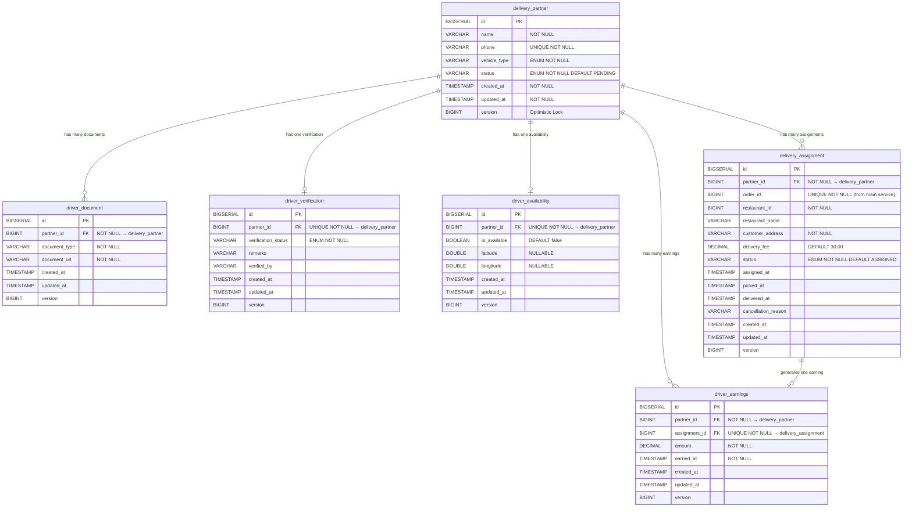

# Delivery Partner Service — Database Design

## ER Diagram



---

## Table Reference

### 1. `delivery_partner` — Core partner registry

| Column | Type | Constraint | Notes |
|--------|------|-----------|-------|
| `id` | BIGSERIAL | PK | Auto-generated |
| `name` | VARCHAR(255) | NOT NULL | |
| `phone` | VARCHAR(20) | UNIQUE, NOT NULL | 10-digit Indian format `[6-9]XXXXXXXXX` |
| `vehicle_type` | VARCHAR | NOT NULL | Enum: `BIKE`, `SCOOTER`, `CAR`, `VAN` |
| `status` | VARCHAR | NOT NULL | Enum below ↓ |
| `created_at` | TIMESTAMP | NOT NULL | Set on persist |
| `updated_at` | TIMESTAMP | NOT NULL | Set on update |
| `version` | BIGINT | | Optimistic locking |

**`PartnerStatus` lifecycle:**
```
PENDING → DOCUMENT_VERIFICATION_PENDING → ACTIVE
                                        ↘ DOCUMENT_VERIFICATION_REJECTED
ACTIVE → SUSPENDED
```

---

### 2. `driver_document` — KYC documents uploaded by driver

| Column | Type | Constraint | Notes |
|--------|------|-----------|-------|
| `id` | BIGSERIAL | PK | |
| `partner_id` | BIGINT | FK → `delivery_partner.id`, NOT NULL | |
| `document_type` | VARCHAR | NOT NULL | e.g. `AADHAR`, `PAN`, `DRIVING_LICENSE` |
| `document_url` | VARCHAR | NOT NULL | URL to storage |
| `created_at` | TIMESTAMP | | |
| `updated_at` | TIMESTAMP | | |
| `version` | BIGINT | | |

> One partner can have **multiple documents** (1→N).  
> Duplicate document type per partner is blocked at service layer.

---

### 3. `driver_verification` — Admin verification record

| Column | Type | Constraint | Notes |
|--------|------|-----------|-------|
| `id` | BIGSERIAL | PK | |
| `partner_id` | BIGINT | FK → `delivery_partner.id`, **UNIQUE**, NOT NULL | One record per partner |
| `verification_status` | VARCHAR | NOT NULL | Enum: `PENDING`, `APPROVED`, `REJECTED` |
| `remarks` | VARCHAR | | Admin notes |
| `verified_by` | VARCHAR | | Admin name (future: Keycloak user) |
| `created_at` | TIMESTAMP | | |
| `updated_at` | TIMESTAMP | | |
| `version` | BIGINT | | |

> Created automatically when partner uploads first document.  
> Updated by admin via Approve/Reject.

---

### 4. `driver_availability` — Real-time online/offline status

| Column | Type | Constraint | Notes |
|--------|------|-----------|-------|
| `id` | BIGSERIAL | PK | |
| `partner_id` | BIGINT | FK → `delivery_partner.id`, **UNIQUE**, NOT NULL | |
| `is_available` | BOOLEAN | DEFAULT false | true = online |
| `latitude` | DOUBLE | NULLABLE | Last known location |
| `longitude` | DOUBLE | NULLABLE | Last known location |
| `created_at` | TIMESTAMP | | |
| `updated_at` | TIMESTAMP | | |
| `version` | BIGINT | | |

> Only `ACTIVE` partners can toggle this.  
> Record is created on first toggle, then updated.

---

### 5. `delivery_assignment` — Order-to-driver assignments

| Column | Type | Constraint | Notes |
|--------|------|-----------|-------|
| `id` | BIGSERIAL | PK | |
| `partner_id` | BIGINT | FK → `delivery_partner.id`, NOT NULL | Assigned driver |
| `order_id` | BIGINT | **UNIQUE**, NOT NULL | From main food service |
| `restaurant_id` | BIGINT | NOT NULL | From main food service |
| `restaurant_name` | VARCHAR | NULLABLE | Display only |
| `customer_address` | VARCHAR | NOT NULL | Delivery destination |
| `delivery_fee` | DECIMAL(10,2) | NOT NULL, DEFAULT 30.00 | ₹ fixed fee |
| `status` | VARCHAR | NOT NULL | Enum below ↓ |
| `assigned_at` | TIMESTAMP | | When assignment created |
| `picked_at` | TIMESTAMP | NULLABLE | When driver picked up |
| `delivered_at` | TIMESTAMP | NULLABLE | When delivered |
| `cancellation_reason` | VARCHAR | NULLABLE | |
| `created_at` | TIMESTAMP | | |
| `updated_at` | TIMESTAMP | | |
| `version` | BIGINT | | |

**`AssignmentStatus` lifecycle:**
```
ASSIGNED → ACCEPTED → PICKED_UP → DELIVERED
    ↘          ↘          ↘
              CANCELLED
```

---

### 6. `driver_earnings` — Per-delivery earnings log

| Column | Type | Constraint | Notes |
|--------|------|-----------|-------|
| `id` | BIGSERIAL | PK | |
| `partner_id` | BIGINT | FK → `delivery_partner.id`, NOT NULL | |
| `assignment_id` | BIGINT | FK → `delivery_assignment.id`, **UNIQUE**, NOT NULL | One earning per delivery |
| `amount` | DECIMAL(10,2) | NOT NULL | Copied from `delivery_fee` |
| `earned_at` | TIMESTAMP | NOT NULL | When delivery was completed |
| `created_at` | TIMESTAMP | | |
| `updated_at` | TIMESTAMP | | |
| `version` | BIGINT | | |

> Auto-created when driver calls `markDelivered()`.  
> One record per assignment (enforced by UNIQUE constraint).

---

## Relationship Summary

| Relationship | Type | Details |
|---|---|---|
| `delivery_partner` → `driver_document` | One-to-Many | Partner uploads multiple KYC docs |
| `delivery_partner` → `driver_verification` | One-to-One | One verification record per partner |
| `delivery_partner` → `driver_availability` | One-to-One | One availability record per partner |
| `delivery_partner` → `delivery_assignment` | One-to-Many | Partner can have many delivery history |
| `delivery_partner` → `driver_earnings` | One-to-Many | Partner earns per delivery |
| `delivery_assignment` → `driver_earnings` | One-to-One | One earning per assignment |

---

## MongoDB Collections (planned, not yet implemented)

| Collection | Purpose |
|------------|---------|
| `delivery_event_log` | Every status change with timestamp — audit trail |
| `driver_activity_log` | Driver went online/offline/accepted/delivered timeline |

---

## Integration Point with Main Food Service

The main food service only needs to send/receive:

```
POST /api/delivery/assign
Body: { orderId, restaurantId, restaurantName, customerAddress }

GET /api/delivery/order/{orderId}
Returns: { status, driverName, driverPhone, assignedAt, pickedAt, deliveredAt }
```

> `order_id` in `delivery_assignment` is the **foreign reference** to the main service's order table.  
> No JPA join — cross-service data is kept by contract only (no cascading).
