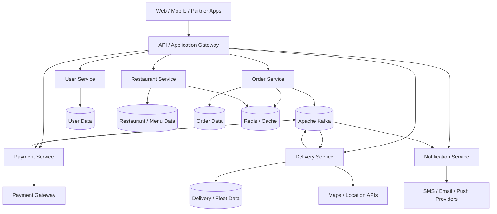
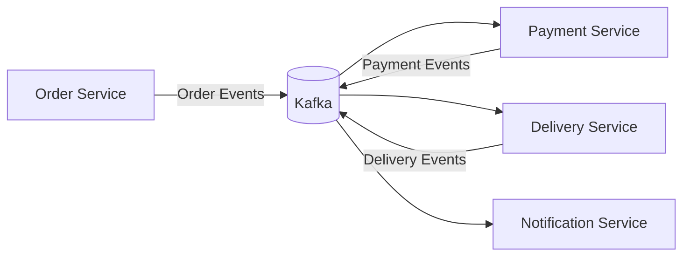
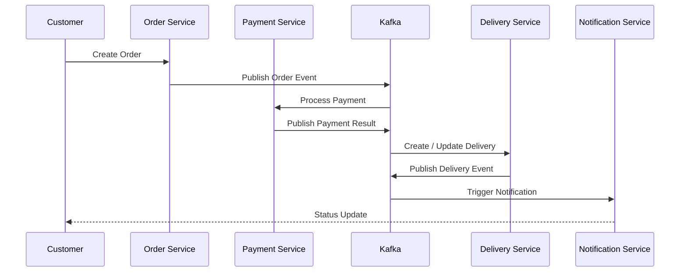
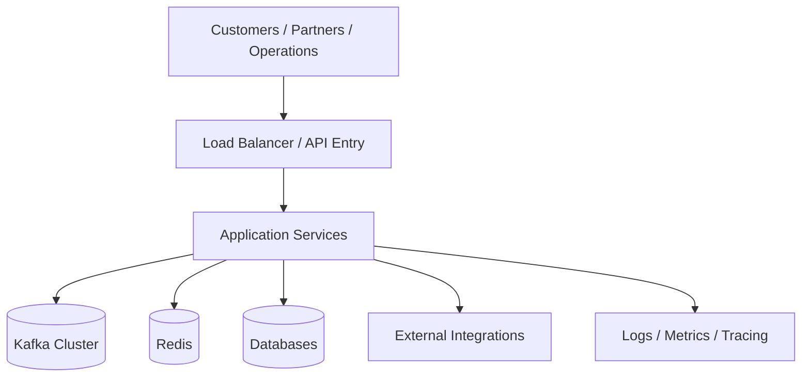

<div align="center">

# 🍔 CraveRush

### Food Commerce & Fleet Coordination Platform

A scalable, event-driven food delivery ecosystem connecting **customers**, **restaurants**, **payments**, and **delivery fleets** through a unified microservices architecture.

[](https://www.oracle.com/java/)
[](https://spring.io/projects/spring-boot)
[](https://kafka.apache.org/)
[](https://www.postgresql.org/)
[](https://redis.io/)
[](https://www.docker.com/)
[](https://kubernetes.io/)
[](#license)

[Overview](#-overview) •
[Architecture](#-platform-architecture) •
[Tech Stack](#-technology-stack) •
[Getting Started](#-getting-started) •
[Documentation](#-documentation) •
[Roadmap](#-future-improvements)

</div>

---

## 📖 Overview

**CraveRush** is a food commerce and delivery coordination platform designed for **high-volume ordering, restaurant discovery, payment processing, delivery workflows, driver coordination, real-time tracking, promotions, notifications, and business analytics.**

The platform is built around **scalable backend services**, **asynchronous event processing**, **caching**, **database-driven workflows**, and **integrations with external systems** — modeled after production-grade food delivery ecosystems (Swiggy/DoorDash-style architecture).

> ⚠️ **Note:** Performance figures, technology choices, and feature completeness in this document should be verified against the actual deployed system before external publication. Sections marked *(proposed)* or *(target)* are not guaranteed to reflect current production state.

### ✨ Key Features

| Category | Capabilities |
|---|---|
| 🔍 **Discovery** | Restaurant search, categories, filters, personalized recommendations |
| 🍽️ **Ordering** | Menu browsing, cart management, multi-step checkout workflows |
| 📦 **Order Management** | Full order lifecycle — creation, validation, state transitions, history |
| 💳 **Payments** | Payment initiation, confirmation, status tracking, refund processing |
| 🚚 **Delivery & Fleet** | Driver assignment, live tracking, ETA calculation, fleet coordination |
| 📍 **Real-Time Telemetry** | High-frequency driver location updates decoupled from core transactions |
| 🎁 **Promotions** | Discount campaigns, coupon engines, targeted offers |
| 🔔 **Notifications** | Multi-channel alerts via push, SMS, and email |
| ⭐ **Community** | Ratings, reviews, and customer feedback loops |
| 📊 **Analytics** | Operational dashboards and business intelligence |
| 🔌 **Integrations** | Payment gateways, maps/geolocation, messaging providers |

---

## 🏗️ Platform Architecture

CraveRush follows a **microservices architecture** with an API gateway, independently deployable services, and an event-driven backbone powered by Apache Kafka.



### Core Services

<details>
<summary><strong>👤 User Service</strong></summary>

Manages authentication, user profiles, customer information, preferences, and account-related workflows.

- Registration & login (JWT-based auth)
- Profile & preference management
- Session/token lifecycle handling
</details>

<details>
<summary><strong>🏪 Restaurant Service</strong></summary>

Handles restaurant profiles, menus, categories, search, availability, ratings, and discovery.

- Menu & category CRUD
- Search & filter engine
- Availability and operating-hour logic
- Ratings aggregation
</details>

<details>
<summary><strong>🧾 Order Service</strong></summary>

Owns cart and checkout workflows, order creation, validation, order state changes, order history, and order events.

- Cart lifecycle management
- Order validation & pricing
- State machine for order status transitions
- Publishes order events to Kafka
</details>

<details>
<summary><strong>💳 Payment Service</strong></summary>

Handles payment initiation, confirmation, payment status, refunds, and payment-provider integration.

- Payment gateway abstraction layer
- Idempotent payment processing
- Refund workflows
- Publishes payment result events
</details>

<details>
<summary><strong>🚚 Delivery Service</strong></summary>

Manages driver assignment, delivery lifecycle, driver status, location updates, ETA, and fleet coordination.

- Driver-order matching/assignment engine
- Real-time location ingestion
- ETA computation
- Delivery status state machine
</details>

<details>
<summary><strong>🔔 Notification Service</strong></summary>

Processes customer and operational notifications through supported channels such as push, SMS, and email.

- Event-driven notification triggers
- Multi-channel dispatch (push/SMS/email)
- Template management
</details>

---

## ⚡ Event-Driven Architecture

Apache Kafka serves as the **asynchronous communication backbone** for all cross-service business events, reducing direct service coupling and enabling independently scalable, resilient asynchronous processing.

### Event Categories

- 🧾 **Order events** — created, updated, cancelled
- 💳 **Payment events** — initiated, succeeded, failed, refunded
- 🚚 **Delivery events** — assigned, picked up, in-transit, delivered
- 📍 **Driver-location updates** — high-frequency telemetry stream
- 🔔 **Notification events** — triggered downstream from all of the above



### Order Lifecycle Sequence



---

## 🚚 Real-Time Fleet & Delivery

The delivery layer supports a full real-time coordination pipeline:

- Driver availability & status tracking
- Automated driver assignment
- Active delivery monitoring
- Live driver location streaming
- Route information & ETA calculation
- Delivery status transitions
- Driver telemetry ingestion
- Fleet-wide coordination

> **Design principle:** Real-time telemetry is architecturally separated from core order transactions, preventing high-frequency location updates from coupling with — or degrading — transactional workloads.

---

## 📈 Scale

The platform is designed for high-volume production traffic:

| Metric | Target |
|---|---|
| Concurrent Users | 40,000+ |
| Requests per Second | 4,000+ |

> ⚠️ Keep these figures only if they accurately reflect a real, tested/deployed system. Verify against load-testing results before using in external/portfolio materials.

---

## 🗄️ Data & Caching

### Data Domains

```
├── User Data
├── Restaurant & Menu Data
├── Order & Cart Data
├── Payment Data
├── Delivery & Driver Data
└── Analytics Data
```

### Caching Strategy

Redis is used for **read-heavy, low-latency access patterns**, including:

- Restaurant discovery results
- Menu and category data
- Recommendation payloads
- Frequently accessed configuration

---

## 🔌 Integrations

| Integration Type | Purpose |
|---|---|
| 💳 Payment Gateways | Transaction processing & settlement |
| 🗺️ Maps / Geolocation | Route calculation, ETA, live tracking |
| 📱 SMS Providers | Order & delivery updates |
| 📧 Email Providers | Transactional & marketing communication |
| 🔔 Push Notification Services | Real-time app notifications |
| 📊 Analytics & Tracking | Behavioral and operational insights |

---

## 🛠️ Technology Stack

<table>
<tr>
<td valign="top" width="25%">

**Backend**
- Java
- Spring Boot
- RESTful APIs
- Microservices
- Event-driven architecture

</td>
<td valign="top" width="25%">

**Messaging**
- Apache Kafka

**Data**
- PostgreSQL
- MongoDB
- Redis

</td>
<td valign="top" width="25%">

**Frontend**
- React
- Next.js

</td>
<td valign="top" width="25%">

**Infrastructure**
- Docker
- Kubernetes
- AWS / Cloud Infra
- CI/CD

</td>
</tr>
</table>

> 🔄 **Keep this section synchronized** with the actual implementation. Remove any technology not present in the repository or deployed system.

---

## 🚀 Getting Started

### Prerequisites

```
Java 17+
Maven or Gradle
Docker & Docker Compose
Node.js 18+ (for frontend)
PostgreSQL / MongoDB
Apache Kafka
Redis
```

### Local Setup

```bash
# 1. Clone the repository
git clone https://github.com/<your-org>/craverush.git
cd craverush

# 2. Start infrastructure dependencies (Kafka, Redis, Postgres, Mongo)
docker-compose up -d

# 3. Build and run backend services
cd services/order-service
mvn clean install
mvn spring-boot:run

# 4. Run the frontend
cd ../../frontend
npm install
npm run dev
```

### Environment Configuration

Create a `.env` file (or `application.yml` per service) with the required variables:

```env
# Database
POSTGRES_URL=jdbc:postgresql://localhost:5432/craverush
MONGO_URI=mongodb://localhost:27017/craverush

# Kafka
KAFKA_BROKER_URL=localhost:9092

# Redis
REDIS_HOST=localhost
REDIS_PORT=6379

# Payment Gateway
PAYMENT_GATEWAY_API_KEY=your_key_here

# Maps / Geolocation
MAPS_API_KEY=your_key_here

# Notification Providers
SMS_PROVIDER_API_KEY=your_key_here
EMAIL_PROVIDER_API_KEY=your_key_here
```

> 📌 Replace all placeholder values with real credentials before running in any non-local environment. Never commit secrets to version control.

---

## 📦 Deployment Architecture



Docker is used for containerization, and Kubernetes for orchestration and horizontal scaling where applicable.

---

## 🔐 Security Considerations

Production deployments must protect:

- 🪪 Customer identity
- 🔑 Authentication credentials
- 💳 Payment information
- 🚚 Driver information
- 📍 Location data
- 🔗 Internal service communication

### Recommended Controls

- [ ] JWT-based authentication
- [ ] Role-based access control (RBAC)
- [ ] TLS everywhere (in-transit encryption)
- [ ] Secure secret management (e.g., Vault, AWS Secrets Manager)
- [ ] Request validation & sanitization
- [ ] Rate limiting & throttling
- [ ] Audit logging

> ⚠️ Mark controls as **implemented** only once verified in source code — this list represents recommended, not guaranteed, coverage.

---

## 📊 Observability

Key operational signals monitored across the platform:

| Signal | Why It Matters |
|---|---|
| API Latency | End-user experience, SLA compliance |
| Throughput | Capacity planning |
| Error Rates | Service reliability |
| Service Health | Uptime & readiness |
| Kafka Consumer Health | Event pipeline reliability |
| Event Lag | Real-time processing delays |
| Database Performance | Query & transaction bottlenecks |
| Cache Performance | Hit/miss ratio, latency reduction |
| Delivery Tracking Health | Real-time telemetry pipeline integrity |

---

## ⚙️ Performance & Reliability

- High-throughput, horizontally scalable APIs
- Asynchronous, event-driven workloads
- Clear service-level separation of concerns
- Multi-layer caching strategy
- Independent per-component scaling
- Reliable, replayable event processing
- Isolation of transactional vs. operational workloads

---

## 🧩 Engineering Challenges

<details>
<summary><strong>High Request Volume</strong></summary>

Requires efficient APIs, optimized database access, aggressive caching, and horizontally scalable service deployment.
</details>

<details>
<summary><strong>Real-Time Tracking</strong></summary>

Driver telemetry generates frequent updates that demand efficient asynchronous processing pipelines separate from transactional flows.
</details>

<details>
<summary><strong>Distributed Workflows</strong></summary>

Orders, payments, delivery, and notifications span multiple independently owned business services, requiring careful event choreography and eventual consistency handling.
</details>

<details>
<summary><strong>External Dependency Failures</strong></summary>

Payment, maps, and communication providers require controlled retries, timeouts, circuit breakers, and graceful degradation strategies.
</details>

---

## 🗺️ Future Improvements

> The following are **proposed enhancements**, not existing features, unless explicitly implemented and verified.

- [ ] ML-based delivery ETA prediction
- [ ] Route optimization engine
- [ ] Demand forecasting
- [ ] Intelligent restaurant recommendations
- [ ] Automated customer support (chatbot/AI agent)
- [ ] Fraud detection system
- [ ] Advanced operational control center
- [ ] Multi-region deployment
- [ ] Deeper distributed tracing (OpenTelemetry)
- [ ] Event replay & stronger disaster recovery

---

## 📁 Project Structure *(suggested)*

```
craverush/
├── services/
│   ├── user-service/
│   ├── restaurant-service/
│   ├── order-service/
│   ├── payment-service/
│   ├── delivery-service/
│   └── notification-service/
├── gateway/
├── frontend/
│   ├── web/            # React / Next.js app
│   └── mobile/
├── infrastructure/
│   ├── docker/
│   ├── k8s/
│   └── ci-cd/
├── docs/
│   ├── architecture/
│   └── api-specs/
├── docker-compose.yml
├── .env.example
└── README.md
```

---

## 🧑‍💻 Role & Responsibilities

**Role:** Full-Stack Developer / Software Architect

Typical responsibilities on this project:

- Backend architecture design
- REST API development
- Microservices development
- Kafka producer/consumer implementation
- Database schema design
- Performance optimization
- Delivery & fleet coordination workflows
- Third-party integrations
- Deployment & infrastructure support

---

## 📚 Documentation

| Resource | Description |
|---|---|
| [Architecture Overview](#-platform-architecture) | High-level system design |
| [API Documentation](./docs/api-specs) *(add link)* | Endpoint specifications |
| [Deployment Guide](./docs/deployment) *(add link)* | Infra setup & CI/CD |
| [Contributing Guide](./CONTRIBUTING.md) *(add file)* | Contribution guidelines |

---

## 🏢 About

**CraveRush** is part of the software engineering portfolio of **Eryon AI Software Solutions**.

- 🌐 Website: [eryonai.com](https://www.eryonai.com)
- 📧 Email: [connect@eryonai.com](mailto:connect@eryonai.com)
- 🛠️ Services: Custom Software Development · Web & Mobile Apps · AI Solutions · SaaS · ERP & CRM · Cloud & DevOps · API & Microservices

---

## 📄 License

This project is proprietary software developed as part of the Eryon AI Software Solutions portfolio. Contact [connect@eryonai.com](mailto:connect@eryonai.com) for licensing inquiries.

---

<div align="center">

**⚠️ Documentation Note:** Before publishing, verify all service names, technology choices, performance numbers, and architecture diagrams against the current CraveRush source code and deployment environment.

<sub>Built with ❤️ for scalable food commerce</sub>

</div>
